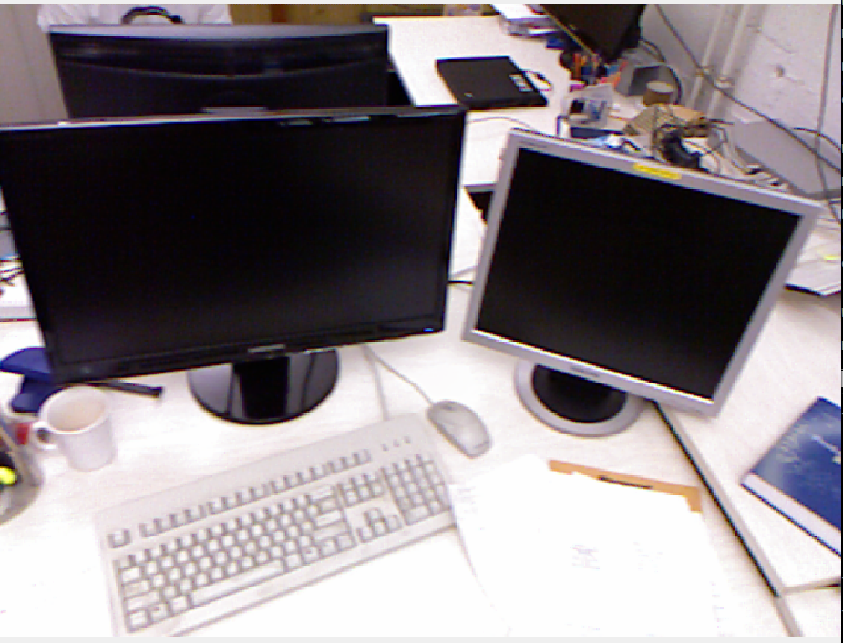
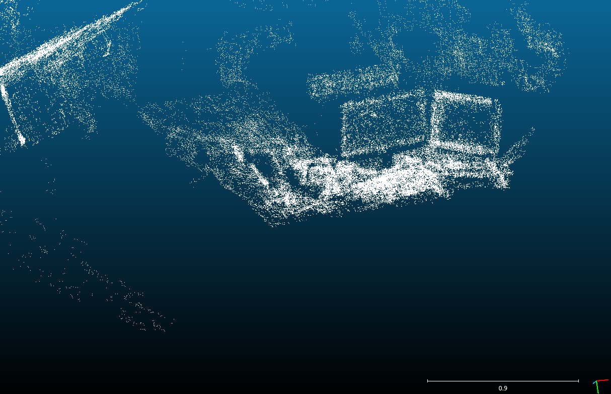

# Deep Feature Matching SLAM

A simple SLAM system based on feature matching using Deep Learning.

# Next steps
[] Include Bundle Adjustment
[] Test pose estimation in different datasets
[] Include Loop Closure
[] Optimize DFM Model to TensorRT

# How to Install

1. Clone this repository into a `catkin_workspace` inside the `src` folder. Then compile it.

```
catkin_make
```

2. Install the requirements as follows:
```
conda install pytorch torchvision torchaudio pytorch-cuda=11.6 -c pytorch -c nvidia
```

Then

```
pip install tqdm opencv-python~=4.5 numpy scipy 
```

3. Inside the `$ROOT/feature_tracker/scripts/feature_tracker.py`, modify the **first line** to the conda environment executable path.

# How to Run
TODO

# Performance

Currently it was tested on `rgbd_dataset_freiburg1_xyz.bag` from: https://vision.in.tum.de/data/datasets/rgbd-dataset/download. The reconstruction you can see in the image below.



